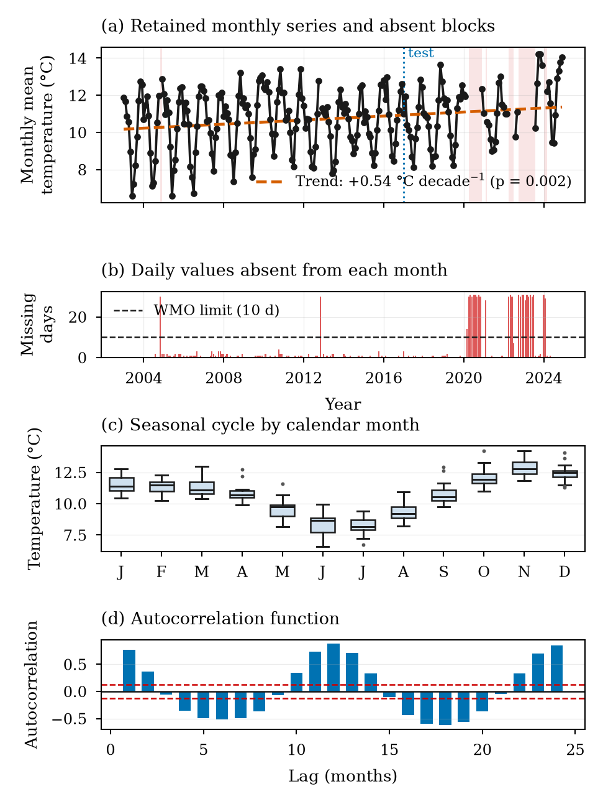
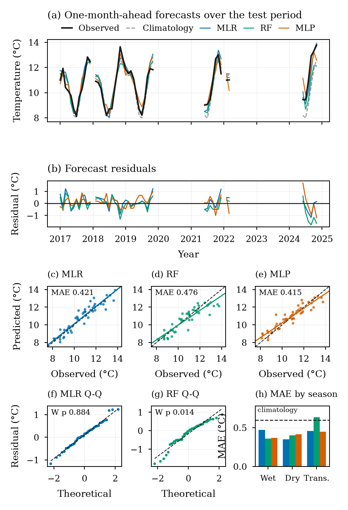
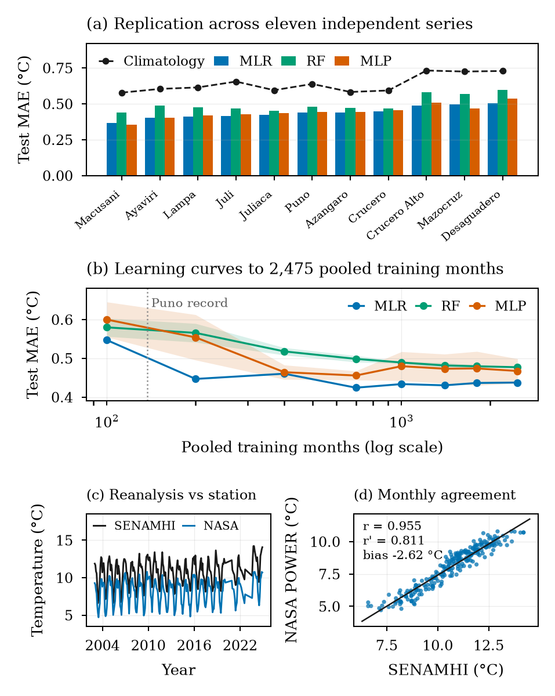

# Monthly Temperature Forecasting Across the Peruvian Altiplano

**Does machine learning beat the climatological baseline? Multiple linear regression,
random forest and a multilayer perceptron, verified against climatology and persistence
at a station record and replicated across eleven independent series.**

[](https://doi.org/10.51847/zMqqEu22RP)
[](https://environmentaljournals.org)
[](https://creativecommons.org/licenses/by/4.0/)
[](https://www.python.org/)
[](https://power.larc.nasa.gov/)
[](#key-results)
[](#reproducing-the-results)

**Published in:** *World Journal of Environmental Biosciences*, Vol. 15, No. 3 (2026), 102–112 ·
DOI [10.51847/zMqqEu22RP](https://doi.org/10.51847/zMqqEu22RP) ·
[article page](https://environmentaljournals.org/article/multiple-linear-regression-outperforms-machine-learning-for-monthly-temperature-forecasting-across-t-axe1yhycbdcbgon)

Professional School of Statistical and Informatics Engineering, Universidad Nacional del
Altiplano de Puno, Peru. This repository holds the code, the data and every reported value;
the article itself is distributed by the journal.

---

## Overview

Monthly temperature forecasts guide planting calendars, irrigation scheduling and
frost-protection decisions in the Peruvian Altiplano, where a single frost outside the
expected window can destroy a season of quinoa or potato production. Studies in the
region routinely report coefficients of determination near 0.90 for machine learning
models — but in a regime whose seasonal cycle spans 4.68 °C while within-month
variability averages 0.71 °C, **a model that reproduces only the annual cycle already
achieves that number**.

This study asks a narrower and harder question: *does machine learning beat the
climatological reference that operational meteorology has used for a century?*



*The Puno Principal Climatological Station, 2003–2024. (a) the retained monthly series,
its trend and the six absent blocks; (b) daily values missing per month against the WMO
completeness limit; (c) the seasonal cycle that dominates the variance; (d) the
autocorrelation function, peaking at lag 12.*

The answer is yes, but modestly — and **the simplest model wins**.

Two practices are controlled at once, because either one alone hides the problem:

| Practice controlled | Why it matters |
|---|---|
| A climatological baseline | Without it, an R² of 0.90 cannot be distinguished from reproducing the annual cycle |
| A strictly chronological split | Random splits leak future months into training and inflate apparent accuracy |

---

## Key results

Test period at Puno, January 2017 – November 2024, 49 months. MSSS is the mean square
error skill score against climatology; DM is the Diebold-Mariano test against climatology.

| Model | MAE (°C) | RMSE (°C) | R² | MSSS | DM p | Test/train ratio |
|---|:---:|:---:|:---:|:---:|:---:|:---:|
| Persistence | 0.866 | 1.059 | 0.520 | −0.958 | 0.004 | — |
| Climatology | 0.597 | 0.757 | 0.755 | +0.000 | — | — |
| **Multiple linear regression** | **0.421** | **0.532** | **0.879** | **+0.505** | **0.029** | **1.01** |
| Random forest | 0.476 | 0.629 | 0.831 | +0.310 | 0.031 | 2.11 |
| Multilayer perceptron | 0.415 | 0.541 | 0.875 | +0.489 | 0.051 | 1.37 |



*Forecasts over the test period, with line breaks at months rejected by the completeness
rule. Panels (f) and (g) show why the linear model is preferred: only its residuals are
normally distributed and serially independent.*

- **All three models beat climatology**, cutting MAE from 0.597 °C to between 0.415 °C
  and 0.476 °C — roughly half of the mean square error climatology leaves behind.
- **Persistence is significantly worse than climatology** (MSSS = −0.958). In a regime
  where month-to-month change exceeds the interannual variability of any single month,
  carrying the previous month forward is worse than ignoring it. Persistence alone
  cannot serve as the baseline in seasonal climates.
- **The perceptron's apparent lead is an artefact of one random seed.** Across 50
  initialisations it averages 0.495 °C (SD 0.048), and only **4 of 50** beat the
  deterministic 0.421 °C of linear regression. An ensemble of all fifty attains
  0.4209 °C against 0.4208 °C — fifty networks reproduce, at fifty times the cost, what
  a twelve-parameter closed-form regression delivers in one fit.
- **Only linear regression satisfies its own assumptions.** Its residuals pass both
  Shapiro-Wilk (p = 0.884) and Ljung-Box (p = 0.079). Random forest fails both and leaves
  a lag-one autocorrelation of 0.427 unexploited: its errors are not merely larger but
  systematically patterned.
- **Atmospheric covariates contribute nothing.** Removing humidity, precipitation and
  diurnal range moves the linear model from 0.4208 °C to 0.4226 °C — a difference of
  0.002 °C. An operational service here needs temperature and a calendar.

### Where the skill actually comes from

| Predictor set | k | MLR | RF | MLP |
|---|:---:|:---:|:---:|:---:|
| Seasonal only | 3 | 0.599 | 0.597 | 0.593 |
| Thermal memory only | 4 | 0.704 | 0.537 | 0.610 |
| Seasonal + memory | 8 | 0.423 | 0.476 | 0.476 |
| Without atmospheric covariates | 9 | 0.423 | 0.468 | 0.506 |
| All predictors | 12 | 0.421 | 0.476 | 0.415 |

Seasonal information alone is statistically indistinguishable from climatology itself
(0.599 vs 0.597 °C): three predictors encoding the annual cycle add nothing to knowing
the calendar month. Only the *combination* of seasonality with recent thermal state
produces the improvement.

---

## Replication across eleven series



*(a) test MAE by site; (b) pooled learning curves to 2,475 training months, eighteen
times the Puno record; (c, d) NASA POWER against the SENAMHI station record.*

The whole protocol was rerun on eleven independent NASA POWER series, 792 pooled test
months. Two pairs of the thirteen retrieved locations (Ayaviri/Cojata, Juli/Yunguyo)
proved numerically identical because each pair falls inside the same MERRA-2 grid cell,
and the redundant members were removed.

| | Climatology | MLR | RF | MLP |
|---|:---:|:---:|:---:|:---:|
| Pooled MAE (°C), 792 test months | 0.640 | **0.438** | 0.474 | 0.453 |
| Sites where the model ranks first | — | **9 / 11** | 0 / 11 | 2 / 11 |

- Every model beats climatology at **every** site, so the improvement replicates cleanly.
- **Sample size is not the explanation.** Pooled learning curves reach 2,475 training
  months and the machine learning curves flatten *above* the linear model without
  crossing it at any measured size. What used to be an untestable limitation is now a
  measured result.
- **Seed instability does not fade with more data.** At the pooled sample the perceptron
  still varies by SD 0.045 °C across initialisations, with 2 of 20 beating the linear
  model. It reflects the optimisation landscape of the architecture, not a shortage of
  data.

### On the anomaly correlation

An earlier version of this analysis reported the agreement between the reanalysis and the
station record as an "anomaly correlation" of 0.955. That figure was computed after
subtracting only each series' **overall mean**, which leaves the shared annual cycle
intact — so it was really the raw correlation under another name. Recomputed against each
series' own **monthly climatology**, the anomaly correlation is **0.811**.

The correction is worth stating plainly because it is the paper's own thesis turned on
the paper: the same seasonal inflation that makes an uninformative forecast look skilful
also makes two datasets look more concordant than they are. Both values are now reported
side by side in Figure 3d, and `17_revision_figures.py` computes them.

---

## Repository structure

```
.
├── data/
│   └── senamhi_puno_2003_2024.xlsx     station record, 2003-2024
├── analysis/
│   ├── config.py                       paths, constants, WMO thresholds
│   ├── 01_…14_….py                     the analysis pipeline, in execution order
│   ├── 15_repository_qr.py             QR code printed in the article
│   ├── 16_revision_tables.py           Tables 1-4 as published
│   ├── 17_revision_figures.py          Figures 1-3 as published
│   ├── data/                           generated intermediates + NASA POWER CSVs
│   ├── results/                        JSON report per stage, plus every table
│   └── figures/                        300 dpi, TIFF + PNG
├── requirements.txt
├── CITATION.cff
└── LICENSE
```

Every stage writes a JSON report next to its outputs, so each number in the article can
be traced to the script that produced it.

### Which files correspond to the published tables and figures

The journal limits tables and figures to seven items combined, so the article reports
four consolidated tables and three multi-panel figures. Scripts `16` and `17` build them
from the JSON reports written by scripts `01`–`13`; **they refit no model**, so their
values are identical to those of the underlying analysis.

| Published item | File |
|---|---|
| Table 1 · Record, absent periods, retained series | `analysis/results/rev_table1_record.csv` |
| Table 2 · Accuracy, skill, generalisation | `analysis/results/rev_table2_performance.csv` |
| Table 3 · Residuals, seeds, ablation, season | `analysis/results/rev_table3_diagnostics.csv` |
| Table 4 · Replication across eleven series | `analysis/results/rev_table4_replication.csv` |
| Figure 1 · Record and temporal structure | `analysis/figures/figure1_record_and_structure.*` |
| Figure 2 · Forecast performance | `analysis/figures/figure2_forecast_performance.*` |
| Figure 3 · Replication and scaling | `analysis/figures/figure3_replication_and_scaling.*` |

The remaining `table*.csv` and `figure4`–`figure9` files are the granular outputs of
scripts `04`, `05`, `07` and `14`, kept because the consolidated items are built from them.

---

## Installation

Python 3.11 is recommended, matching the environment the published values were produced in.

```bash
git clone https://github.com/Andre031222/monthly-temperature-forecasting-altiplano.git
cd monthly-temperature-forecasting-altiplano

python -m venv .venv
source .venv/bin/activate        # Windows: .venv\Scripts\activate
pip install -r requirements.txt
```

Verify the environment:

```bash
python -c "import numpy, pandas, sklearn, scipy, matplotlib; print('ok')"
```

---

## Reproducing the results

Run the scripts in order from inside `analysis/`. Each one writes what the next one reads.

| # | Script | What it does |
|---|---|---|
| 01 | `01_load_aggregate.py` | Loads the workbook, audits it, detects the duplicate station sheet |
| 02 | `02_calibrate_and_build.py` | Calibrated reconstruction of missing daily means, WMO monthly aggregation |
| 03 | `03_models.py` | Models, baselines, Diebold-Mariano tests, bootstrap intervals |
| 04 | `04_figures.py` | Granular figures |
| 05 | `05_tables.py` | Granular tables |
| 06 | `06_extended_analysis.py` | Ablation, seasonal breakdown, residual diagnostics, learning curve |
| 07 | `07_figures_extended.py` | Granular figures |
| 08 | `08_sanity_checks.py` | Split integrity, missing-data audit, permutation leakage test |
| 09 | `09_scaling_extrapolation.py` | Power-law fit and crossing-point bootstrap |
| 10 | `10_seed_stability.py` | 50-seed replication of the stochastic models |
| 11 | `11_download_nasa_power.py` | Retrieves 13 series from the public NASA POWER API |
| 12 | `12_validate_nasa_power.py` | Independence check and validation against SENAMHI |
| 13 | `13_multistation_replication.py` | 11-series replication, pooled learning curves |
| 14 | `14_figures_replication.py` | Granular figures |
| 15 | `15_repository_qr.py` | QR code for this repository |
| 16 | `16_revision_tables.py` | **Tables 1-4 as published** |
| 17 | `17_revision_figures.py` | **Figures 1-3 as published** |

Every random operation is seeded, so the reported values reproduce exactly. Scripts `16`
and `17` read only stored JSON and CSV, so they can be rerun on their own to regenerate
the published tables and figures without repeating the hyperparameter search.

**No API key or registration is required.** `11_download_nasa_power.py` queries the
public NASA POWER endpoint directly.

### Validation design

Both evaluations split strictly by time — no future month reaches training.

```
Puno station          2003              Dec 2016 │ Jan 2017         Nov 2024
                       ├───── TRAIN ────────────┤ ├──── TEST ──────────┤
                            137 months                49 months

Replication (×11)     2000              Dec 2018 │ Jan 2019         Dec 2024
                       ├───── TRAIN ────────────┤ ├──── TEST ──────────┤
                        2,475 months pooled          792 months pooled
```

Hyperparameters were tuned by blocked time-series cross-validation confined to the
training years — 54 candidate configurations for random forest, 32 for the perceptron.
The test set was consulted once, after selection had closed. A permutation test
(`08_sanity_checks.py`) confirms the absence of leakage: shuffling the target destroys
accuracy in all 200 permutations.

---

## Data

**Station record.** Puno Principal Climatological Station (SENAMHI), 15.84° S, 70.02° W,
≈3,820 m a.s.l., on the western shore of Lake Titicaca.

| Parameter | Value |
|---|---|
| Period | 1 January 2003 – 31 December 2024 |
| Daily records | 7,279 of 8,036 calendar days |
| Absent days | 757 (9.4%), in six blocks rather than scattered |
| Months meeting the WMO rule | 236 of 264 (89.4%) |
| Monthly series | mean 10.72 °C, SD 1.62 °C, range 6.59–14.21 °C |
| Trend | +0.54 ± 0.17 °C decade⁻¹ (p = 0.0017) |
| Variables | mean/max/min temperature, relative humidity, precipitation |

A month is admitted only under the completeness rule of
[WMO-No. 1203](https://library.wmo.int/idurl/4/55797): rejected if more than 10 daily
values are missing, or 5 or more consecutively. Missing daily means were reconstructed
from the daily extremes by a regression calibrated **on training years only**; its bias
is measured, not assumed — 606 values recovered, 604 of them inside the retained months,
8.4% of their days.

**Replication data.** [NASA POWER](https://power.larc.nasa.gov/) daily MERRA-2 reanalysis,
2000–2024, 9,132 records per location with no missing values, for the same thirteen
Altiplano locations used in a previous regional frost-prediction study. Reanalysis is
colder than the station record by 2.577 °C, so it cannot serve as ground truth — but each
series is modelled and evaluated against itself, and a constant offset cancels within
that comparison.

---

## Authors

Professional School of Statistical and Informatics Engineering, Universidad Nacional del
Altiplano de Puno, Peru. Listed in the order of the published article.

| Author | ORCID iD |
|---|---|
| **Leonel Coyla-Idme** \* | [ 0000-0003-3538-1061](https://orcid.org/0000-0003-3538-1061) |
| Vidman Ruis Roque-Mamani | — |
| Smit Alexander Suni-Morales | — |
| Keysi Salcca-Lagar | — |
| Alex Arias-Ramírez | — |
| Antony Jhonatan Flores-Nina | — |
| Richar Andre Vilca-Solorzano | [ 0009-0003-2385-5263](https://orcid.org/0009-0003-2385-5263) |

<sub>\* Corresponding author — <lcoyla@unap.edu.pe></sub>

---

## Citation

```bibtex
@article{CoylaIdme2026Altiplano,
  title   = {Multiple Linear Regression Outperforms Machine Learning for Monthly
             Temperature Forecasting across the Peruvian Altiplano},
  author  = {Coyla-Idme, Leonel and
             Ruis Roque-Mamani, Vidman and
             Suni-Morales, Smit Alexander and
             Salcca-Lagar, Keysi and
             Arias-Ram{\'i}rez, Alex and
             Flores-Nina, Antony Jhonatan and
             Vilca-Solorzano, Richar Andre},
  journal = {World Journal of Environmental Biosciences},
  volume  = {15},
  number  = {3},
  pages   = {102--112},
  year    = {2026},
  issn    = {2277-8047},
  doi     = {10.51847/zMqqEu22RP}
}
```

`CITATION.cff` carries the same metadata in machine-readable form.

---

## Limitations

- Only one of the twelve series is a direct station record. The replication rests on
  reanalysis, which establishes that the **ordering** of models transfers across sites,
  not the absolute accuracy attainable at those sites.
- The Puno test set is 49 months — enough to separate the models from climatology, not
  enough to resolve differences among them. Their bootstrap intervals overlap, and the
  ranking reverses between seasons.
- The 792 pooled test months are not fully independent: neighbouring series correlate up
  to 0.963.
- 8.4% of the daily values entering the retained months were reconstructed by calibration.
- The horizon is one month. This skill should not be extrapolated to longer horizons,
  where the informative content of recent thermal state decays.

---

## License

Code, data and documentation in this repository: **CC BY 4.0**, see [LICENSE](LICENSE).
The published article is distributed by the journal under **CC BY-NC-SA 4.0** and belongs
to *World Journal of Environmental Biosciences*. NASA POWER data is in the public domain;
the SENAMHI station record is reproduced here for verification of the published analysis.
